# Frente E: el grafo de los cierres, y cuáles quedan en falso (S146)

> Auditoría de sólo lectura, 2026-09-20. No se tocó `pipeline/`, `frontend/`, perfiles, `data/`,
> `CLAUDE.md` ni el catálogo. No se usó git para escribir. No se corrió pytest. Archivos creados:
> este informe y `experiments/_s146_auditoria/frente_E/` (`construir_grafo.py`, `grafo.json`,
> `grafo.mmd`). Cada arista lleva el `archivo:línea` que leí en esta sesión. Lo que infiero sin que
> esté escrito va marcado INFERIDA, y lo que no verifiqué, SOSPECHA. Este frente **no decide si el
> cierre de abajo es verdadero o falso**: eso es de los frentes A a D. Acá está la estructura: quién
> cuelga de quién, y qué premisa hereda cada uno.

## Por qué importa, en una frase de geólogo

Un cierre es como un mapa que dice "acá no hay falla, no busques". Si ese mapa se dibujó con una
fotografía aérea que después resultó estar mal georreferenciada, todos los mapas que se calcaron de
él heredan el error, y nadie vuelve a caminar esa quebrada. Este informe sigue los calcos.

---

## 1. Cobertura (primero)

**Documentos rectores.**

| documento | cómo lo leí |
|---|---|
| `docs/MIROVA_DIVERGENCES.md` (2.379 líneas) | **entero**, en cinco tramos (1 a 560, 560 a 1119, 1119 a 1598, 1598 a 2017, 2017 a 2379) |
| `CLAUDE.md` (1.554 líneas) | entero como contexto cargado de la sesión, más verificación por `sed`/`grep` de cada línea que cito (los números de línea del contexto podían diferir del disco) |
| `docs/MISSION.md` (227) | líneas 24 a 40 y 60 a 227. **No leí** 1 a 23 ni 41 a 59 |
| `docs/HYPOTHESIS_LOG.md` (1.556) | índice completo de encabezados y estados (por `grep`), más el cuerpo de: 9 a 30, 140 a 177, 259 a 310, 334 a 480, 626 a 695, 714 a 822 y 1456 a 1556. **No leí** el cuerpo de 31 a 139, 178 a 258, 481 a 625, 823 a 1455 |
| `docs/META_RULES_S80.md` (356) | sólo un barrido por palabras de cierre (2 coincidencias, ninguna es un cierre). **No lo leí entero** |
| `docs/PLAN_AUDITORIA_S146.md`, censo `.md` y estructura del `.json` | enteros |
| `docs/AUDIT_S138.md`, `docs/audit_s145/D21_D22_ESTADO_DEL_BLOQUEO.md`, `docs/audit_s145/A2_EL_FALLO_ES_DEL_CRITERIO.md` | enteros |
| `docs/audit_s145/DIVERGENCIAS_MENORES_VERIFICADAS.md`, `D13_CERCA_FRONTEND_REMEDIDA.md`, `TAMANO_FRENTE_ETIQUETADO.md`, `CLASSIFICATION_SUSTRATO_Y_DISENO.md` | por tramos (cobertura, tabla principal y conclusión de cada uno) |
| `experiments/_s137/EL_CIERRE_DE_S136_ES_CIRCULAR.md` | entero |
| `experiments/_s136/POR_QUE_EL_RUIDO_NO_MUEVE_LA_DETECCION.md` | líneas 1 a 70 |
| `docs/PLAN_AUDITORIA_S138.md`, los ejes de `docs/audit_s138/` y `docs/audit_s139/`, `AUDIT_S114`, `AUDIT_S116`, `AUDIT_S118`, `AUDIT_S121` | **no leídos** (sólo líneas sueltas que aparecieron por `grep`) |

**Los 89 del censo.** Ubiqué y leí en su contexto los 89. El resultado:

- **57** quedaron dentro de algún nodo del grafo (el conteo sale de cruzar `grafo.json` contra
  `censo_cierres.json`, no a mano).
- **32** los revisé buscando dependencias y no les encontré ninguna hacia otro cierre, o no son
  cierres. Están listados en la sección 6 con su razón.
- Además el grafo tiene **40 nodos que el censo no ve: 21 cierres y 19 premisas o reglas**. Entre los
  cierres hay varios redactados con otras palabras: "límite físico aceptado", "OFF permanentemente", "no es un parche", "thresholds NO
  son el problema", "empíricamente óptima", "quedan intactas". El censo es un piso, como él mismo
  declara.

**Estado real de los flags**, leído hoy de `pipeline.profile` con `VRP_PROFILE=mirova_equivalent`
(nunca del YAML): `ENABLE_TESTS_23_PROSE_BRANCH=False`, `ENABLE_MODIS_B22_PRIMARY=False`,
`NTI_BT_SANITY_K=3.0`, `ENABLE_TEST1_K1_RETIRE_FROM_HOT_MASK=False`,
`ENABLE_SECOND_PASS_CONDITIONED=False`, `ENABLE_UTM_REGRID=False`, `CLOUD_MASK_BT_K=0.0`,
`ENABLE_UNSUITABLE_FILTERS_267_273=True`, `ENABLE_TEST1_CONTEXTUAL_KEEP_PEAK=True`,
`ENABLE_PATH_D_INTRA_RADIO_GATE=False`, `ENABLE_SECOND_PASS_INTRA_RADIO_GATE=False`,
`ENABLE_LOCAL_KERNEL_BG=True`, `MAX_SIGMA_COMPONENT_K=999.0`, `PATH_D_ONLY_CAP_MW=5.0`,
`ENABLE_ROI1_BOX_PAPER=False`, `ENABLE_DAYTIME_MODIS=False`. Un flag leído dice cómo está
configurado el sistema, no que el fenómeno se fue (A87): lo uso sólo para saber bajo qué
configuración se midió cada cierre.

**Lo que este instrumento NO garantiza.** Las aristas las anoté yo leyendo; el script sólo calcula
estructura (arrastre y ciclos) y trae un control con un grafo de juguete que aborta si el cálculo
falla. Si una arista está mal anotada, el script no lo nota: la defensa es la cita textual de cada
una, que un tercero puede abrir. **Un cierre que no aparece con aristas no está certificado como
independiente**: puede depender de algo que vive en un documento que no leí.

**Nota de instrumento sobre el censo (E-20).** `CLAUDE.md` cambió después de generarse el censo
(commit `0de9d1cd6`, cierre de S145, agregó A111 y A112). Desde la línea 1249 los números del censo
quedaron corridos **34 líneas**: `CLAUDE.md:1412` es hoy `:1446`, `:1512` es `:1546`, `:1513` es
`:1547`, `:1515` es `:1549`. Los otros frentes que usen esas cuatro filas van a abrir la línea
equivocada. Es A101 aplicada al propio censo.

---

## 2. El grafo

**Tamaño**: 63 nodos (43 cierres, 20 premisas o reglas), **73 aristas de dependencia** (60
EXPLÍCITAS, 13 INFERIDAS) y 5 relaciones que no son dependencia (4 "contradicho por", 1 "tensión"),
que no entran al cálculo de arrastre. **2 ciclos.** Todo en
`experiments/_s146_auditoria/frente_E/grafo.json`, con la evidencia de cada arista.

Cómo leerlo: la flecha va del cierre de **arriba** a aquello en que se **apoya**. Flecha continua,
dependencia EXPLÍCITA (está escrita). Flecha punteada, INFERIDA. Los nodos redondeados son premisas
o reglas; en rojo, las que **el propio proyecto** ya declaró falsas, rebajadas, obsoletas, abiertas
como divergencia o reabiertas.

```mermaid
graph TD
  P_S114(["Auditoria de fidelidad S114 (file:line + adversarial)"])
  P_B21(["Configuracion banda 21 primaria (= D21 abierta)"])
  P_GATE(["Compuerta bt  mayor que  t_bg + 3 K en Tests 2 y 3 (= D22 ..."])
  P_MIN(["Conectiva min(C1, mu+C2 sigma) como lectura de MIROVA"])
  P_PISO(["'El piso C1 gobierna el 100 % de MODIS y el 99,9 % de VIIR..."])
  P_BAT(["Criterio de la bateria del Apendice A: 9 de 9, caja de 5 k..."])
  P_S137_A2(["S137: 'la bateria guarda distancias pero no posiciones' (c..."])
  P_535(["Regimen de datos previo al PR 535 (mascara de nube 260 K a..."])
  P_A54(["A54 / AUDIT_S86: el 95,4 % de los 'FP' son anomalias fisic..."])
  P_S99(["Hecho canonico S99: MIROVA NRT = un algoritmo por sensor, ..."])
  P_FENCE(["La cerca del frontend: mirovaEqVrp pone en cero todo recor..."])
  P_PICO(["D10: 'el pixel pico = el crater' (justificacion de keep_peak)"])
  P_A13(["A13: Distancia_km de Villarrica fija en 0,84 km"])
  P_A12(["A12: ejemplo 'Lascar 21,6 K e Isluga ~20 K no necesitan ke..."])
  P_31(["D13: 'la cerca apaga el 31 % de la MAGNITUD'"])
  P_QC(["'MIROVA hace QC visual manual a posteriori' (el cap de 5 M..."])
  P_F70(["Instrumento F70: nuestro regrid UTM (A/B de 4 brazos, S124)"])
  P_FLAGK1(["S100: se juzgo ENABLE_TEST1_K1_RETIRE_FROM_HOT_MASK por su..."])
  P_OSF(["Conteos del OSF v2.5 usados como si fueran el NRT"])
  P_A66(["A66/A67: area nadir fija = 'clon literal'"])
  C_A82["A82: far a summit MODIS 'irreducible a 1 km, agotado, no r..."]
  C_D11["D11 cara far a summit: CERRADA S114, CONDICIONADA S138"]
  C_A83["A83: no existe discriminante fisico per-record; 'agotado'"]
  C_A84["A84: la posicion within-inner del ctx_cluster es irreducib..."]
  C_D13["D13: clasificacion CERRADA S126; 'no volver a plantearla'"]
  C_NEW8["NEW-8 (filtros de no-aptos 267-273): 'sigue abierto, A/B F..."]
  C_D9["D9 path-D cirrus: EFECTIVAMENTE RESUELTA en sus dos caras ..."]
  C_D9CAP["D9: 'el cap de 5 MW NO es un parche' (S71)"]
  C_D12["D12: camino 'distance_class desde el cluster' NO ADOPTAR (..."]
  C_A85["A85 / gates intra-radio S84-S85: flip OFF, 'MANTENER OFF, ..."]
  C_A81["A81: re-derivar distance_class simetrico es una trampa; no..."]
  C_A94["A94: el bug de la etiqueta far rinde 1 noche de 946 (no pr..."]
  C_D10["D10 ctxpeak (filtro contextual + keep_peak): ADOPTADO S100..."]
  C_D5["D5 magnitud: 'resuelta' / 'calibracion lograda'"]
  C_D26["D26: segundo pase sin filtros de no-aptos, 'efecto nulo ba..."]
  C_S136_3["S136: tres frentes cerrados sin A/B (pool de mu/sigma, ret..."]
  C_S136_AR["S136: banda 22 y remuestreo descartados 'por aritmetica' c..."]
  C_GAPA115["GAP PR A: RESUELTO S115 = mislabel, NO reabrir"]
  C_NEW7["NEW-7 / drift PR 1 (S100): flag K1 'OFF permanentemente; e..."]
  C_GAPA130["GAP PR A S130: 'documentado y dimensionado, sin mas invers..."]
  C_D16["D16: 'la grilla UTM NO explica el sub-reporte', CERRADA (r..."]
  C_D18["D18 caja 5x5: A/B S130 NO ADOPTAR; 'diferenciacion summit/..."]
  C_D8["D8 fondo de anillo contaminado: RESUELTO (kernel-bg opt-in..."]
  C_DPCC["D-PCC inner_radius: RESUELTO S62 ('inner=7 adoptado')"]
  C_S29["S29: 'Lascar 64 % queda como limite fisico aceptado' del M..."]
  C_D11B["D11-bis: 'MIROVA nunca publica 0,0; incluso Villarrica da ..."]
  C_HV084["H_S61_MIROVA_DIST_FIXED_VILLARRICA: CONFIRMADA"]
  C_H13["H13: '3 sigma no es problematico; mantener cap MAX_SIGMA_C..."]
  C_HS68["H_S68_ANTIPATRONES: 'anti-patrones mitigados, NO hay drift..."]
  C_D20["D20 banda 31 vs 32: 'numericamente despreciable' (calculo ..."]
  C_D21["D21: 'ningun brazo cumple aun la bateria' (bloqueo)"]
  C_HA2["H_S137_A2_FLANCO: 'active, pendiente'"]
  C_S143["H_S143_D22_D25: NO ADOPTAR (VIIRS 375)"]
  C_S133["S133: A/B banda 22 en MODIS, NO ADOPTAR"]
  C_THR["S71: 'thresholds NO son el problema' (descarta tunear C2/s..."]
  C_F14["F1.4: geofencing 25 km 'empiricamente optimo' (98,27 % de ..."]
  C_S45["S45: 'D9 cluster selection: summit-priority confirmado Las..."]
  C_D19N["D19 (S134): 'D11/A82 quedan intactas'"]
  C_A77["A77: VIIRS375 cubre el recall que MODIS no resuelve"]
  C_D25V["D25 en M-band (S145): 'es fidelidad de magnitud, no recall'"]
  C_HV2["H_S141_VECINO_FOCO_V2: resuelta como no confirmada"]
  C_A82 --> P_S114
  C_A82 --> P_B21
  C_A82 --> P_GATE
  C_A82 --> C_A77
  C_D11 --> C_A82
  C_A82 --> C_D11
  C_D11 --> P_S114
  C_D11 --> P_B21
  C_D11 --> P_GATE
  C_D11 --> C_GAPA115
  C_D11 --> C_D21
  C_D21 --> P_BAT
  C_D21 --> P_S137_A2
  C_HA2 --> P_S137_A2
  C_S143 -.-> P_BAT
  C_A83 --> C_A82
  C_A83 --> P_B21
  C_A83 --> P_GATE
  C_A84 --> C_A82
  C_A84 --> C_A83
  C_D12 --> P_B21
  C_D12 --> P_GATE
  C_S133 --> P_GATE
  C_D13 --> C_A82
  C_D13 --> P_A54
  C_D13 --> P_31
  C_D13 --> P_535
  C_NEW8 --> C_A82
  C_NEW8 --> C_D9
  C_NEW8 --> P_A54
  C_D9 --> C_NEW8
  C_D9 --> P_FENCE
  C_D9 --> P_A66
  C_D9 --> C_D9CAP
  C_D9CAP --> P_QC
  C_D9 -.-> P_535
  C_A85 --> P_FENCE
  C_A85 --> P_S99
  C_A85 --> C_A82
  C_A85 -.-> P_535
  C_A81 -.-> C_A82
  C_A94 --> C_A81
  C_D10 --> P_PICO
  P_A66 --> C_D10
  C_D5 --> P_A66
  C_D5 --> C_D10
  C_D26 --> P_PISO
  C_D26 --> P_MIN
  C_S136_3 --> P_MIN
  C_S136_3 --> P_PISO
  C_S136_AR --> P_PISO
  C_S136_AR --> P_MIN
  C_GAPA130 -.-> C_S136_3
  C_GAPA130 -.-> P_PISO
  C_GAPA115 --> C_NEW7
  C_NEW7 --> P_FLAGK1
  C_D16 --> P_F70
  C_D16 --> P_535
  C_S136_AR -.-> C_D16
  C_D18 --> C_A82
  C_D18 --> P_S99
  C_D18 -.-> P_B21
  C_D8 --> P_A12
  C_D8 -.-> P_S99
  C_D5 -.-> C_D8
  C_DPCC -.-> C_D8
  C_D11B --> P_A13
  C_HV084 --> P_A13
  C_D20 -.-> P_PISO
  C_THR -.-> P_B21
  C_F14 --> P_OSF
  C_D19N --> C_A82
  C_D25V --> C_HV2
  C_D12 -. tension .-> C_D9
  C_S29 -. contradicho por .-> C_D12
  C_S45 -. contradicho por .-> C_D11
  C_HS68 -. contradicho por .-> P_A54
  C_H13 -. contradicho por .-> P_S99
  classDef caido fill:#f8d7da,stroke:#a33;
  class P_S114,P_B21,P_GATE,P_MIN,P_PISO,P_BAT,P_S137_A2,P_535,P_A54,P_PICO,P_A13,P_A12,P_31,P_QC,P_F70,P_FLAGK1,P_OSF,P_A66 caido;
```

**Advertencia sobre el arrastre.** El número "cuántos cierres caen si éste cae" pasa por los dos
ciclos, así que dentro de la familia A82/D11 es una **cota superior**: todo lo que llega a A82 llega
también a D11, y por D11 a la batería. Lo digo para que nadie lea "14" como una medición fina.

---

## 3. Los cierres en falso, ordenados por cuánto trabajo apagan

Un cierre "en falso" acá es uno que **sigue escrito como cierre** y cuelga de algo que el proyecto
mismo ya declaró caído. No afirmo que su conclusión sea falsa; afirmo que **hoy nadie sabe si es
verdadera**, y que el texto manda a no mirar.

### E-01. La familia A82 / D11 no se rebajó hacia abajo: siete cierres siguen citando "irreducible" como si estuviera en pie. GRAVEDAD 5

**Qué apaga**: todo intento de separar el foco real del gradiente topográfico en los nevados, de
corregir la etiqueta `far` de MODIS, de levantar o rediseñar la cerca del dashboard, de re-anclar la
posición, y el A/B de los filtros de no-aptos. Es el corazón del problema de sobre-publicación (A98).

**La cadena, eslabón por eslabón.**

1. **Raíz caída**: la auditoría S114 "detección MODIS fiel". `CLAUDE.md:948-953` dice que no miró la
   geometría del ROI (rebaja S124); `CLAUDE.md:112-119` dice que nunca miró los pasos previos a los
   Tests (D21 banda primaria, D22 compuerta). Flags de hoy: B21 primaria y compuerta de 3 K, las dos
   divergencias abiertas.
2. **A82** (`CLAUDE.md:948`) ya lleva las dos rebajas. **D11** (`MIROVA_DIVERGENCES.md:1259`) ya
   dice CONDICIONADA. Hasta acá el proyecto hizo el trabajo.
3. **Lo que no se hizo**: los que cuelgan de A82 **no tienen marca**:
   - **A83** (`CLAUDE.md:981`): "Mecanismo (A82): a 1 km el foco sub-píxel real y el ruido
     topográfico difuso son el MISMO objeto", y en `:983` "está agotado (anti-A8)". Sin marca.
     `AUDIT_S138.md:94-96` escribió que A83 y A84 heredan la configuración en duda, pero eso nunca
     bajó al texto de la regla.
   - **A84** (`CLAUDE.md:989-990`): "irreducible igual que el far→summit (A82) ... instance-en-posición
     de A82/A83", y `:1001` "NO reabrir". Sin marca.
   - **D13** (`MIROVA_DIVERGENCES.md:1503-1504`): la cerca no se toca porque lo que esconde es "el
     artefacto topográfico A69 en los nevados, que a 1 km es irreducible (A82)". Sin marca. Ver E-05.
   - **NEW-8 / S116** (`MIROVA_DIVERGENCES.md:493`): el A/B es "no accionable (aplicarlo removería
     señal real, killer A82)". Sin marca. Ver E-02.
   - **A85 / gates** (`MIROVA_DIVERGENCES.md:1447`): el peor caso se clasifica como "difuso A69/A82".
   - **D18** (`MIROVA_DIVERGENCES.md:2039-2041` y `:2065-2066`): se define por su relación con A82.
   - **D19** (`MIROVA_DIVERGENCES.md:2191-2192`), escrito en S134: "D11/A82 quedan intactas". Cuatro
     sesiones después D11 quedó condicionada **en el mismo archivo** y esta frase no se tocó.
4. **Tres redacciones vivas del mismo cierre, que no coinciden** (contradicción, sección 5):
   `MISSION.md:105-108` dice "CERRADA S114 (irreducible a 1 km; detección fiel a Coppola verificada
   file:line; todos los ejes agotados)" **sin ninguna marca**; `CLAUDE.md:1547-1550` dice que el
   "irreducible" **vale para la vía espectral** y que sólo la geometría queda libre;
   `CLAUDE.md:948` dice que quedó rebajada **también por la vía espectral**. Y dentro del propio
   D11, `MIROVA_DIVERGENCES.md:1315-1317` repite "la detección MODIS YA es FIEL" sin marca en el
   lugar (la marca está 56 líneas más arriba, en el encabezado).
5. **Y debajo de D11 hay otro piso que se movió en S145**: D11 espera a D21 y D22
   (`MIROVA_DIVERGENCES.md:1259`), D21 está "bloqueada" porque "ningún brazo cumple aún la batería"
   (`:2232`), y el único fallo del mejor brazo es del criterio, no del algoritmo
   (`docs/audit_s145/A2_EL_FALLO_ES_DEL_CRITERIO.md:82-85`). Ver E-04.

**Confianza**: alta en la estructura (todas las aristas son EXPLÍCITAS). **No** afirmo que A83 o A84
sean falsas: sus mediciones (S116, S117, S106) pueden sostenerse solas. Lo que cae es la frase que
las ata a A82 y el "agotado, no reabrir" que de ahí se deriva.

### E-02. NEW-8 figura como "gap abierto, A/B no accionable" y los filtros están ENCENDIDOS en producción desde S72. GRAVEDAD 4

**Qué apaga**: confunde dos frentes a la vez. Hace creer que hay un gap de fidelidad pendiente que
no existe, y sostiene el argumento de D26 y del GAP #A sobre una descripción equivocada del pool.

**La cadena.**

1. `MIROVA_DIVERGENCES.md:435`: "Los gaps (2)(3)(4) NEW-8 (edge/dNTI<-0.1/dETI<-0.1) **siguen
   vigentes**". `:476`: F2.1 "en implementación". `:485`: "Sigue abierto, prioridad rebajada".
   `:493`: "A/B F2.1 = baja prioridad / no accionable ... NO obsoleto (el gap de fidelidad literal
   del pool m,σ persiste)". `MISSION.md:112` lo lista entre las abiertas.
2. El código dice otra cosa. `pipeline/profile.py:662-677`, leído hoy: "Ese fix entró en
   mirova_equivalent operacional sin gating explícito ... Cuando ON (default True post-F1.2.a)".
   Valor efectivo leído de `pipeline.profile`: **`ENABLE_UNSUITABLE_FILTERS_267_273 = True`**. El
   flag existe desde el commit `d58f7a46f` (2026-05-21, S72).
3. El propio catálogo lo confirma sin darse cuenta: D26 (`MIROVA_DIVERGENCES.md:2359`) dice que "el
   primer pase sí los aplica".
4. O sea que el veredicto de S116 ("aplicarlo removería señal real") razona sobre **aplicar algo que
   ya estaba aplicado** cuando se escribió. Es el patrón "declarado distinto de efectivo" (S126) y
   A89.

**Confianza**: alta en que el flag está en `True` y en que los textos dicen "abierto". SOSPECHA
(no lo tracé): que los tres procesadores pasen el flag en todos los caminos. Eso le toca al frente B.

### E-03. D16 "la grilla NO explica el sub-reporte, CERRADA, NO REABRIR" se probó con un instrumento que el proyecto después declaró roto por tres lados. GRAVEDAD 4

**Qué apaga**: el remuestreo, que es el paso del paper que falta (D17, D28) y el único mecanismo de
magnitud que el proyecto tiene **probado** (S130, gradiente cenital).

**La cadena.**

1. Cierre: `MIROVA_DIVERGENCES.md:1857` "CERRADA (refutada) S124" y `:1898` "NO REABRIR como
   probemos la grilla (anti-A8)".
2. El instrumento fue nuestro regrid F70 (`:1859-1863`). Tres caídas posteriores, todas escritas:
   - **centrado en el punto equivocado**: `:1959-1962`, con 6 de 11 volcanes corridos más de media
     celda (`:1973-1974`);
   - **vecino más cercano con huecos**: `AUDIT_S138.md:135-136` y `:322` ("no es el remuestreo de
     MIROVA");
   - **sin bow tie**: `:2369-2371` (D28), y `:1937-1939` avisa que regridear sin de-solapar duplica
     píxeles calientes e infla "en dirección contraria al error".
3. **Ventana** 2026-06-25 a 08-24 (`:1863`): entera antes del #535, con la máscara de 260 K viva en
   VIIRS 375 (A104, `CLAUDE.md:1194-1196`).
4. Y el catálogo se contradice unas líneas más abajo: `:1924-1940` dice que "el mecanismo geométrico
   SÍ quedó probado, por otro eje: el ÁNGULO", y que la explicación es que MIROVA remuestrea.
5. **Un segundo cierre cuelga del mismo lugar**: S136 descartó el remuestreo "por aritmética"
   (`experiments/_s136/POR_QUE_EL_RUIDO_NO_MUEVE_LA_DETECCION.md:43-47`), y S137 mostró que ese
   cálculo trata el remuestreo como promediado de ruido blanco, cosa que el paper no dice
   (`experiments/_s137/EL_CIERRE_DE_S136_ES_CIRCULAR.md`, sección "Sobre el punto 2").

**Matiz honesto**: `:1898-1899` remite a D17 ("lo que queda vivo es otra cosa"), así que el catálogo
no está ciego. Pero el encabezado sigue diciendo "CERRADA (refutada)", y lo refutado fue **ese
regrid**, no "la grilla". **Confianza**: alta.

### E-04. Todo lo que S136 cerró "bajo `min`" y "porque el piso gobierna": el encabezado de D26 sigue intacto después de S145, y el GAP #A hereda la misma premisa sin decirlo. GRAVEDAD 4

**Qué apaga**: el pool de μ y σ, el retiro de los píxeles del Test 1 de ese pool (GAP #A), el ajuste
de C2, la banda 22 como palanca de detección, y D26.

**La cadena.**

1. **Dos premisas, las dos caídas.** (a) La conectiva `min` como lectura de MIROVA: S136 midió que
   no lo reproduce (`CLAUDE.md:1152-1156`). (b) "El piso C1 gobierna el 100 % de MODIS y el 99,9 %
   de VIIRS" (`experiments/_s136/POR_QUE...:18-21`): en S145 resultó que el script lee sólo el dNTI;
   en el dETI el σ gobierna en 58,7 % de VIIRS 375 y 75,0 % de VIIRS 750
   (`docs/PLAN_AUDITORIA_S146.md:19`; `docs/audit_s145/DIVERGENCIAS_MENORES_VERIFICADAS.md:35`).
2. **D26**: `MIROVA_DIVERGENCES.md:2353`, leído hoy, **sigue diciendo** "ABIERTA, efecto nulo bajo
   la conectiva `min`", y `:2359` "el piso gobierna y el efecto sobre el umbral es nulo". S145
   redactó la corrección (`DIVERGENCIAS_MENORES_VERIFICADAS.md:132-133`) y no se aplicó.
3. **Los tres frentes de S136** (`EL_CIERRE_DE_S136_ES_CIRCULAR.md:43-45`): "Bajo `min` siguen
   cerrados" es la última frase de ese documento. Con (b) caída, **ni bajo `min`** están cerrados
   en VIIRS.
4. **INFERIDA, y creo que es lo nuevo de este punto**: el A/B del GAP #A en S130 dio "las cuatro
   firmas idénticas" y el catálogo lo atribuye sólo a la falta de sustrato
   (`MIROVA_DIVERGENCES.md:1335-1345`). Pero el mismo catálogo dice en `:1331` que el daño del K1 en
   el pool es que "suben el umbral μ + C2·σ". Si el piso gobernaba, mover el pool **no podía** mover
   el umbral aunque hubiera sustrato: el nulo tiene dos explicaciones y sólo se nombró una. La
   recomendación "sólo tiene respuesta en Láscar ... no repetir" (`:1356-1358`) hereda eso.
5. **INFERIDA, D20**: "numéricamente despreciable" (`:2219-2222`) compara el corrimiento del NTI
   entre bandas 31 y 32 (hasta 0,0054 a 290 K) contra el margen de K1 (~0,14). Si el umbral que
   decide es el piso C1 = 0,003 (S136; A103 en `CLAUDE.md:1190-1193`), la vara pertinente es 0,003,
   y el "se cancela en el dNTI porque es casi uniforme" es un razonamiento, no una medición, en
   escenas con gradiente de 250 a 290 K (A69). No digo que D20 sea falsa: digo que su vara hereda
   una premisa que otro cierre del mismo proyecto contradice.

**Confianza**: alta en 1 a 3; media en 4 y 5 (INFERIDAS, razonamiento arriba).

### E-05. D9 "EFECTIVAMENTE RESUELTA, no quedan acciones abiertas" se sostiene en la cerca del dashboard, y forma un ciclo con NEW-8. GRAVEDAD 4

**Qué apaga**: el frente de falsos positivos por cirrus y la magnitud del camino contextual. Y A23
manda explícitamente a **no** correr el A/B (`CLAUDE.md:324`).

**La cadena.**

1. `MIROVA_DIVERGENCES.md:534-538`: resuelta en sus dos caras. Cara 1: "capeado + oculto por el gate
   `far` (0 fuga verificada)". `:516-517`: "0 fuga al dashboard (el gate `far` de `mirovaEqVrp` los
   esconde)". **La resolución de la cara de detección es un ocultamiento en el display.**
2. Eso choca con la regla del propio proyecto, A72 (`CLAUDE.md:835-852`): si es artefacto, la raíz
   es no generarlo; los ocultamientos previos de cirrus "son candidatos a migrar a fix de algoritmo".
3. La cerca es justamente D13, cuyo cierre está en falso (E-01, y el 31 % que eran records).
4. Cara 2: "mediana 0,53× ... = calibración clon-literal sana" (`:528-529`), apoyada en
   nadir/focal, que A66 y A67 ya no pueden llamar "clon literal" (`CLAUDE.md:739-740`). Y S125
   declaró que sub-reportar es el frente principal abierto (`:131-137`): el mismo 0,5 a 0,75 que acá
   se lee como "sana".
5. El argumento de que el cap "NO es un parche" incluye: "reemplaza programáticamente el QC visual
   que MIROVA hace manualmente" (`:333`). El proyecto sostiene lo contrario para el NRT
   (`HYPOTHESIS_LOG.md:690-691`; A105 en `CLAUDE.md:1197-1199`).
6. **Tensión** (no dependencia): el camino de D12 se rechazó porque "destapa el path-D, PCC 117 MW"
   (`:1403-1404`). Hay magnitud contextual de tres cifras viva detrás de la etiqueta `far`, con D9
   "sin acciones abiertas".
7. **Ciclo** con NEW-8, sección 5.

**Confianza**: alta en 1, 2, 5 y 6. La dependencia del régimen previo al #535 es INFERIDA y débil
(D9 es sobre todo MODIS, cuya máscara ya valía 0): SOSPECHA.

### E-06. `MISSION.md` lista D5, D8, D9 y D4 como "Resueltas (no justifican features nuevas)", y el catálogo tiene abiertas tres de las cuatro. GRAVEDAD 4

**Qué apaga**: es la **segunda de las tres preguntas vinculantes**. Una propuesta de magnitud o de
fondo que pase por MISSION se encuentra con que la divergencia que cerraría "ya está resuelta".

- **D5 magnitud**: `MISSION.md:100` "D5 magnitud (nadir S102/103 + ctxpeak D10 S100)" resuelta.
  Contra `MIROVA_DIVERGENCES.md:131-137`: "Rebajada de calibración lograda a **abierta pendiente de
  re-medición**", signo opuesto. Y sus dos patas están caídas: nadir = "clon literal" rebajado
  (`CLAUDE.md:739-740`), y ctxpeak descansa en "pico = cráter" (`:1207`), que D19 declara "falso en
  los nevados de señal débil" (`:2189-2192`) y A100 llama "paridad por accidente"
  (`CLAUDE.md:1185`).
- **D8 fondo**: `MISSION.md:100-101` resuelta. Contra D25, `:2316`: "D8 quedó marcada resuelta por
  el kernel opt-in, pero la divergencia literal sigue vigente en 6 de 11 Tier A en MODIS, 11 de 11
  en M-band y todo el camino Test 1". Además la tabla de regímenes de D8 (`:1100-1103`) usa el
  ejemplo que A12 declara FALSO (`CLAUDE.md:235-238`: Isluga 8,3 K, no ~20 K), sin marca en el
  lugar. Y es por volcán, lo que `MISSION.md:82-87` excluye (INFERIDA).
- **D9**: ver E-05.
- **D4**: ver E-09.

La nota de advertencia de `MISSION.md:104` está **dentro de la viñeta "Abiertas"** y habla de "esta
enumeración"; la viñeta "Resueltas" (`:99-103`) no lleva ninguna. **Confianza**: alta.

### E-07. GAP #A: `MISSION.md` todavía dice "RESUELTO S115 = mislabel, NO reabrir", y la lectura de S100 que lo originó sigue sin marca en tres lugares. GRAVEDAD 3

1. Raíz caída: S100 juzgó el flag por su nombre (`MIROVA_DIVERGENCES.md:453-455`: "queda OFF
   permanentemente; el código actual ya es fiel"). S128: gobierna el pool, no el reporte (`:1326-1330`).
2. S138 lo contó como contradicción C1 y corrigió `CLAUDE.md:119`. **No corrigió**:
   `MISSION.md:109-110` ("RESUELTO S115 = mislabel, NO es gap ... NO reabrir"),
   `MIROVA_DIVERGENCES.md:435` ("Mantener OFF permanentemente"), `:453-456` y `:1028` ("NO ES DRIFT
   (S100) ... Código actual (flag OFF) ya fiel").
3. D23 (`:2290`) y D11 (`:1318-1320`) cuelgan del mismo objeto.

La gravedad es 3 y no más porque el sustrato hoy es menor al 0,1 % en MODIS (`:1341-1343`); sube si
un volcán entra en fase efusiva, que es justo cuando importa. **Confianza**: alta.

### E-08. D21 "ningún brazo cumple aún la batería" y H_S137_A2_FLANCO "active, pendiente": los dos descansan en lo que cayó en S145. GRAVEDAD 4

Es el caso del encargo; acá va sólo la estructura. `MIROVA_DIVERGENCES.md:2232` y `:2250-2251`
siguen sin tocar. `HYPOTHESIS_LOG.md:1482-1485` sigue diciendo "no se contrastó ... active", cuando
`A2_EL_FALLO_ES_DEL_CRITERIO.md:75-78` mostró que era verificable desde el día que se escribió (el
rumbo descarta la costa). De D21 cuelga D11 (`:1259`), y de D11 toda la familia de E-01. El criterio
9 de 9 con caja de 5 km es la **raíz con más arrastre del grafo** (sección 4). S143 (NO ADOPTAR en
VIIRS 375) hereda de la batería sólo la **elección de brazos** (INFERIDA); su veredicto está medido
sobre producción y no lo pongo en falso.

### E-09. "Láscar 64 % queda como límite físico aceptado" y "D4 cierra al límite del clon literal": el propio catálogo encontró después que era un error de etiqueta. GRAVEDAD 3

`MIROVA_DIVERGENCES.md:789-793`: "el cráter realmente NO tiene radiancia integrada detectable en
MODIS ... límite físico aceptado"; `:800-801`: "Para mejorar más se requiere divergencia
metodológica". Contra `:1408-1411` (D12): "El `primary_cluster` MODIS está en el cráter (mediana
1,46 km ≈ MIROVA 1,41 km) pero el píxel suelto más caliente cae en el Salar". No era física, era la
asimetría A46. Sin marca en `:789-801`, con D4 "✅ Cerrado S27" en `:577` y en `MISSION.md:99`.
El censo no lo ve (no usa ninguna de sus palabras). **Confianza**: alta.

### E-10. D13 "clasificación CERRADA, no volver a plantearla": cuatro premisas, las cuatro movidas. GRAVEDAD 3

(1) A82 irreducible (`:1503-1504`), E-01. (2) A54 "categoría (b)" (`:1501-1503`): S145 midió que no
existe ningún campo por record que separe (b) de (d), y que la clasificación de S86 fue por volcán y
a mano (`CLASSIFICATION_SUSTRATO_Y_DISENO.md:23-25` y `:146-155`). (3) El título "31 % de la
magnitud" (`:1468`) contra su propia tabla, que rotula records (`:1483-1485`); en magnitud 70,7 %
(`D13_CERCA_FRONTEND_REMEDIDA.md:137`, `:212-213`). (4) Ventana 2026-05-01 a 08-28 (`:1519-1520`):
entera antes del #535. S145 la remidió y aun así escribió que D13 "está cerrada como documental
desde S126 y aquí no se reabre": el cierre sobrevivió a la caída de sus cuatro patas.

### E-11. Identificadores que nombran dos o tres cosas: un "RESUELTO" puede leerse sobre el objeto equivocado. GRAVEDAD 3

No es un cierre en falso sino una fábrica de ellos. Leído hoy:

| sigla | significados que conviven |
|---|---|
| **D2** | cobertura del CSV (`:42`); *drift* N·σ (`CLAUDE.md:107`, `HYPOTHESIS_LOG.md:748`); decisión "segundo pase condicionado" de S134 (`:2176-2186`). `MISSION.md:104-109` pone dos de ellos en la misma viñeta |
| **D3** | FP explícito, "abierta" (`:72`, `CLAUDE.md:1546`); *drift* TIR "**RESUELTO S17**" (`CLAUDE.md:102`) |
| **D9** | path-D cirrus (`:222`); "cluster selection summit-priority" S45 (`:856`, `:885`) |
| **D8** | dos usos, reconocido en `:1196` |
| **D1, D6, D7** | divergencias del catálogo contra *drifts* de `DRIFTS_S17` (`HYPOTHESIS_LOG.md:675`, `:738`, `:825`) |
| **C2** | constante de la Tabla 1; "contradicción C2" de AUDIT_S116 (gates); "C2 peak-of-kernel" de D12 (`:1404`); criterio C2 de varios A/B |

`CLAUDE.md:102` "Drift D3 RESUELTO" y `CLAUDE.md:1546` "abiertas D2 y D3" son las dos ciertas y
hablan de objetos distintos. El censo cuenta `CLAUDE.md:102` como cierre de D3.

### E-12. Cierres viejos del `HYPOTHESIS_LOG` que otro documento rector ya revirtió, sin marca. GRAVEDAD 2

- `:361-373` "dist = 0,84 km fija en Villarrica, **CONFIRMADA**" contra A13 "FALSA"
  (`CLAUDE.md:241-246`) y `MIROVA_DIVERGENCES.md:1138-1144`. **D11-bis** (`:1379-1380`) todavía la
  cita como apoyo; además afirma que MIROVA casi nunca publica 0,0 (10 de 969) mientras la
  corrección de A13 dice que en Villarrica es 0,0 en 3.284 de 3.338. Pueden ser conjuntos distintos
  (alertas contra todos los registros): SOSPECHA, le toca al frente D.
- `:757-768` H13 "mantener `MAX_SIGMA_COMPONENT_K = 7.0` ... innovación nuestra" contra
  `MISSION.md:137` (anti-patrón, neutralizado; leído hoy 999.0) y `CLAUDE.md:106-108`.
- `:160-174` H_S68 "NO hay drift crítico ... 0,6 % ... Negligible" contra `MISSION.md:141-143`
  (S124/S125: Regla D viva, máscara viva, pisos actuando sobre el 6,5 %).
- `:472` CONFIRMADA y `:451` PARCIALMENTE REFUTADA dentro de la misma entrada.
- `:724` Regla D "CONFIRMADA y RESUELTA" contra `MISSION.md:140` (parche rechazado).

### E-13. Otros cierres con premisa heredada, de menor alcance

- **"thresholds NO son el problema"** (`MIROVA_DIVERGENCES.md:403-405`, y `:504` en la tabla "no
  perseguir"). INFERIDA: S137 mide nuestro σ del dNTI diez veces el del autor con banda 21
  (`HYPOTHESIS_LOG.md:1458-1462`). GRAVEDAD 3.
- **F1.4 geofencing "empíricamente óptima"** (`:437`): cuenta records del OSF; A105
  (`CLAUDE.md:1197-1199`) dice que los conteos del OSF no valen para el NRT. GRAVEDAD 2.
- **S45 "summit-priority confirmado"** (título `:856`) contra `:1070-1072` del mismo documento
  ("Esto refuta hipótesis D9 summit-priority exclusiva"). GRAVEDAD 1.
- **D-PCC "RESUELTO S62 ... inner=7 adoptado"** (`:1129-1136`): `volcanoes.yaml:8-17`, leído hoy,
  dice "S62 inner=7 INTENTADO pero REVERTIDO post-reproc" e `inner_radius_km: 20`. A18
  (`CLAUDE.md:285-291`) lo cuenta. El catálogo no se corrigió. GRAVEDAD 2.
- **A85 / gates OFF**: además de A82, se apoya en la cerca ("42/46 filtradas por frontend", `:1446-1447`)
  y el A/B es de junio (INFERIDA: régimen previo al #535). Su núcleo (0 robos en 214 noches) no
  depende de nada caído. GRAVEDAD 2.
- **S133 "banda 22 NO ADOPTAR"**: `AUDIT_S138.md:94-96` lo pone entre los que heredan la
  configuración; S145 agrega que la paridad contra MIROVA tuvo n = 0 en tres de cuatro casilleros
  (`D21_D22_ESTADO_DEL_BLOQUEO.md:153-155`). Midió que la magnitud cambia, no hacia dónde. GRAVEDAD 3.
- **A81 y A94** (INFERIDAS): "73 de NdC = artefacto A69 (NO destapar)" (`CLAUDE.md:940`) usa la
  clasificación de la familia A82; A94 se apoya en A81 (`CLAUDE.md:1138-1139`). GRAVEDAD 2.

---

## 4. Las raíces con más arrastre

Calculado por `construir_grafo.py` (ancestros por cualquier camino; cota superior dentro de los ciclos).

| raíz | estado | arrastre | qué cuelga |
|---|---|---|---|
| Criterio de la batería 9/9 con caja de 5 km (S136) | **caída** S138 y S145 | 14 | D21, y por D21 → D11 → A82, A83, A84, D13, D18, D19 (frase), A85, NEW-8, D9, A81, A94; más S143 |
| Banda 21 primaria (D21) y compuerta 3 K (D22) | **abiertas** | 14 cada una | la familia A82 completa, D12, S133, "thresholds no son el problema" |
| Lectura del flag K1 por su nombre (S100) | **caída** S128 | 14 | NEW-7, GAP #A S115, y por D11 toda la familia |
| Auditoría S114 "detección fiel" | **caída** S124, S137, S138 | 12 | A82, D11 y sus 10 descendientes |
| A77 "VIIRS 375 cubre el recall" | en pie | 12 | es la **única raíz sana** que sostiene el "sin pérdida de alerta" de A82 y D11. Si alguna vez cae, el costo de todo E-01 deja de ser cosmético |
| Régimen previo al #535 | regla A104 | 6 | D13, D16, A85, D9, NEW-8, S136 aritmética |
| "El piso C1 gobierna" (S136) | **caída** S145 | 5 | D26, tres frentes de S136, aritmética de S136, GAP #A S130 (inf.), D20 (inf.) |
| "pico = cráter" (D10) | **caída** S134/S139 | 5 | D10, A66/A67 "mantener ctxpeak", D5, D9 |
| Hecho canónico S99 (un algoritmo por sensor) | en pie | 5 | A85, D18, y en contra de D8 y D-PCC. Es una raíz **sana** que se usa para cerrar desenlaces por volcán; conviene saber que pesa |
| Conectiva `min` | **refutada** como réplica S136 | 4 | D26, S136 (dos cierres), GAP #A S130 (inf.) |
| A54 "95,4 % reales" | **matizada** (A69, D11, S145) | 3 (**piso**) | D13, NEW-8, D9. La anoté sólo donde la cita es textual; A68, A72 y `MISSION.md:25-36` también la usan y no los grafiqué |
| La cerca del dashboard | en pie | 3 | D9, A85, NEW-8: tres "resueltos" que en rigor son "ocultos" |

---

## 5. Ciclos y contradicciones

### Ciclos (2, detectados por el script)

**Ciclo 1, A82 ↔ D11 (cita mutua con raíz común).** D11 concluye con "**Veredicto (A82)**"
(`MIROVA_DIVERGENCES.md:1365`) y `MISSION.md:107` lo respalda con "A82"; A82 se presenta como "S114,
cierre exhaustivo de D11-MODIS" (`CLAUDE.md:957`) y remite a `AUDIT_S114` (`:971`). Son el mismo
cierre escrito dos veces, cada copia citando a la otra como autoridad, y las dos bajan a la misma
auditoría. Efecto práctico, ya ocurrido: las rebajas se aplicaron a cada copia **en fechas distintas
y con alcance distinto** (A82: S124 geometría y S138 espectral; D11: sólo S138; `CLAUDE.md:1549-1550`:
sólo S125 geometría; `MISSION.md:106`: ninguna).

**Ciclo 2, D9 ↔ NEW-8 (justificación mutua).** D9 deja su causa raíz abierta apuntando a NEW-8:
"Los 4 gaps documentales F1.2 explican mejor el drift remanente" (`:464-470`). NEW-8 se desprioriza
apuntando a D9: "ya está mitigado por otros frentes: D9 cap path-D 5 MW" (`:480-482`). Después D9 se
declara "sin acciones abiertas" (`:538`) y NEW-8 "no accionable" (`:493`). Cada uno se cerró
señalando al otro, y ninguno de los dos textos registra que los filtros de NEW-8 están encendidos
desde S72 (E-02).

**Un bloqueo circular que no es de justificación (no lo cuenta el script).** D11 espera a D21/D22
(`:1259`); D21/D22 esperaban la consolidación de las seis contradicciones de S138, una de las cuales
era el encabezado de D11 (`AUDIT_S138.md:272-275`); la consolidación se hizo a medias (E-01 punto 4,
E-07) y el frente "se reemplazó por el plan de paridad" (`D21_D22_ESTADO_DEL_BLOQUEO.md:257-262`),
con las decisiones S138-A, B y C sin tomar.

**Par de cita mutua benigno**: A80 refinada remite a A83 (`CLAUDE.md:926`) y A83 (4) remite a A80.
Misma fuente (S116), sin efecto.

### Contradicciones entre documentos, para la misma cosa

| # | la cosa | uno dice | otro dice |
|---|---|---|---|
| K1 | D11 far→summit | `MISSION.md:105-108` CERRADA, fiel, agotado (sin marca) | `MIROVA_DIVERGENCES.md:1259` CONDICIONADA; `CLAUDE.md:112-119` "FALSO desde S137" |
| K2 | alcance de la rebaja de A82 | `CLAUDE.md:1549-1550` "vale para la vía espectral" | `CLAUDE.md:948` "rebajada también por la vía espectral" (mismo archivo) |
| K3 | GAP #A | `MISSION.md:109-110` RESUELTO, NO reabrir; `MIROVA_DIVERGENCES.md:435`, `:455`, `:1028` "ya es fiel" | `MIROVA_DIVERGENCES.md:1321-1334` REABIERTO; `CLAUDE.md:119` FALSA |
| K4 | NEW-8 | `:435`, `:485`, `:493`, `MISSION.md:112` abierto | flag efectivo `True`; `pipeline/profile.py:662-677`; `:2359` "el primer pase sí los aplica" |
| K5 | D5 magnitud | `MISSION.md:100` resuelta; `:145-146` "✅ lograda" | `:131-137` abierta, signo opuesto |
| K6 | D8 fondo | `:1088`, `MISSION.md:100` resuelto | `:2316` "la divergencia literal sigue vigente" |
| K7 | D16 grilla | `:1857`, `:1898` refutada, no reabrir | `:1924-1940` "el mecanismo geométrico SÍ quedó probado" |
| K8 | D4 / Láscar MODIS | `:577`, `:789-801`, `MISSION.md:99` cerrado, límite físico | `:662` "D4 sigue siendo problema real"; `:836` "parcialmente cerrado"; `:1408-1411` era etiqueta |
| K9 | D-PCC | `:1129-1136` resuelto, inner = 7 | `volcanoes.yaml:8-17` revertido, 20; `:2022` "20 (PCC)" |
| K10 | Villarrica 0,84 | `HYPOTHESIS_LOG.md:373` CONFIRMADA; `:1379-1380` la usa | `CLAUDE.md:241` FALSA; `:1138-1144` REFUTADO |
| K11 | D13 | `:1545-1546` cerrada, no replantear | S145 la remidió y cambió el número del título |
| K12 | D19 sobre D11/A82 | `:2191-2192` "quedan intactas" | `:1259` condicionada |
| K13 | supervisión de MIROVA | `:333` "QC visual que MIROVA hace manualmente"; A76 (`CLAUDE.md:880`) "los limpia por supervisión MANUAL" | `HYPOTHESIS_LOG.md:690-691`; A105 (`CLAUDE.md:1197-1199`). Pueden ser canales distintos (producto por volcán contra NRT): SOSPECHA, frente C |

Trece, con el umbral de A51 en tres.

---

## 6. VERIFICADO LIMPIO: cierres cuyo respaldo no pasa por nada caído

"Limpio" acá significa sólo esto: **revisé de qué se apoya y no encontré ninguna premisa que el
proyecto haya declarado caída.** No certifico su verdad.

**En el grafo, sin premisa caída heredada:**

- **D14 máscara de nube, CERRADA S128** (`:1550`, `:1632-1652`, `MISSION.md:142`): se apoya en una
  cita verbatim con página y en un flag que leí hoy en 0,0. El matiz de S141 (`:1656-1663`) recorta
  una lectura lateral, no el cierre. Es además el cierre que **define** el cambio de régimen del que
  cuelgan otros.
- **Frente `keep_peak` con dirección, CERRADO S144** (`HYPOTHESIS_LOG.md:1536`, `:2099-2108`): nulos
  medidos, siete verificadores, y declara lo que **no** habilita.
- **H_S143 NO ADOPTAR** (`HYPOTHESIS_LOG.md:1507-1520`): medido sobre producción, verificador
  limpio, cobertura pareja. Lo único heredado es la elección de brazos (E-08).
- **H_S141_VECINO_FOCO_V2 no confirmada** y **D25 en M-band "fidelidad, no recall"** (`:2322-2336`):
  pre-registro, controles, ventana declarada.
- **A77**: en pie, y es raíz (sección 4).
- **Núcleo de A85** (0 robos en 214 noches; flags leídos hoy en `False`).

**Los 32 del censo sin arista**, con su razón:

| filas del censo | por qué no entran |
|---|---|
| `META_RULES_S80.md:44`, `CLAUDE.md:24`, `:1114`, `:1160`, `:1238`, `:1246` | **no son cierres**: son texto de reglas que usa la palabra ("refutada", "no reabrir"). Falsos positivos del censo |
| `CLAUDE.md:1412` (hoy `:1446`) | "Delta BT <0.1K, despreciable": afirmación instrumental suelta, sin dependencia. Su número le toca al frente D |
| `CLAUDE.md:102`, `:124`; `HYPOTHESIS_LOG.md:743`, `:780` | *drifts* D1 (media aritmética) y D3 (Stefan-Boltzmann) de S17: respaldo en paper y test, hoja sin hijos. Ojo con la colisión de siglas (E-11) |
| `MIROVA_DIVERGENCES.md:224`, `:1196` | notas de numeración |
| `:1186` D8' selección de cúmulo S38 | anclaje al cráter; A85 lo midió después por otra vía |
| `:1249` ancla S98 | tiene guard (`tests/test_detection_anchor.py`); D17 **lo usa** como premisa sana |
| `:1819` D15 "los GeoTIFF tienen la grilla" | trae su propia salvedad (reproyección, 0/4); A106 la precisó |
| `:656` D4/L_bg global REFUTADO | run citado; hoja |
| `:2304` D24, `:2377` D29 | verificadas en S145 (`DIVERGENCIAS_MENORES_VERIFICADAS.md:34-36`): D24 se sostiene **por otra razón** que la escrita; D29 se sostiene con cota medida |
| `HYPOTHESIS_LOG.md:143`, `:632`, `:662`, `:817` | infraestructura e historia (scraper, NOAA-21, Tupungatito S20, factor 42): hojas |
| `HYPOTHESIS_LOG.md:262`, `:296`, `:337`, `:385`, `:427`, `:451`, `:458`, `:472`, `:724` | la tanda kernel-bg S60 a S62 y Regla D: históricas. Se refutan **entre sí** en cadena (`:296` refuta `:458`; `:451` refuta `:472`; `:418` refutada por S63) y desembocan en D8 (E-06). No las grafiqué una a una: la estructura es una cadena lineal de correcciones, no una dependencia viva |

---

## 7. Lo que no verifiqué (para que nadie lo tome por cubierto)

- No abrí `AUDIT_S114`, `AUDIT_S116`, `AUDIT_S118`, `AUDIT_S121` ni los ejes de S138 y S139. Las
  premisas de esas auditorías las tomo de cómo las resumen los documentos rectores.
- No tracé en el código que los tres procesadores consuman `ENABLE_UNSUITABLE_FILTERS_267_273`
  (E-02). Leí el valor efectivo y el comentario de `profile.py`.
- No medí nada sobre `data/`. Ningún número de este informe es mío: todos son citas con su línea.
- El arrastre de A54 y de la cerca es un **piso**: sólo anoté aristas con cita textual.
- Los bloques de arranque (`tasks/BLOQUE_ARRANQUE_S*.md`) tienen sus propias listas de "cerrado, no
  rehacer" (S138 ya encontró una contradicción ahí, C5). Quedaron **fuera** de este grafo.
